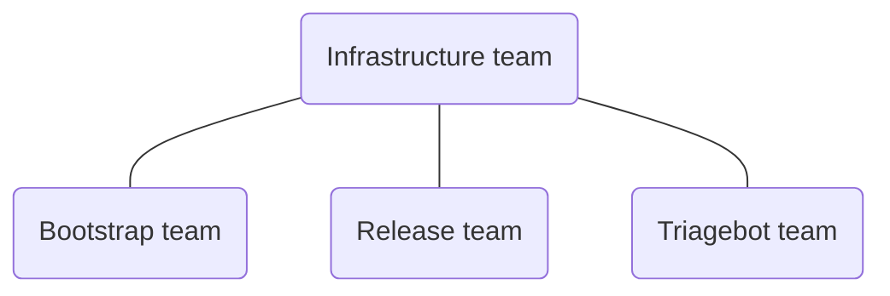

# Rust Infrastructure Team

_Managing the infrastructure supporting the Rust project itself, including CI,
releases, bots, and metrics_

The [Infrastructure Team] is one of the teams of the [Rust Project], tasked with
managing the project's infrastructure. This repository contains internal
documentation about the team's processes and services.

## Structure

The [Infrastructure Team] has three sub-teams:

## Functions

<!-- markdownlint-disable MD013 -->

| Role                   | Team member                                            |
| ---------------------- | ------------------------------------------------------ |
| Co-lead                | [@jdno](https://github.com/jdno)                       |
| Co-lead                | [@shepmaster](https://github.com/shepmaster)           |
| Council Representative | [@Mark-Simulacrum](https://github.com/mark-simulacrum) |

<!-- markdownlint-enable MD013 -->

## Meetings

- [Weekly Team Meeting](./meetings/README.md)

## License

The contents of this repository are dual-licensed under the terms of the
[MIT](./LICENSE-MIT) and the [Apache 2.0](./LICENSE-APACHE) licenses.

[infrastructure team]: https://www.rust-lang.org/governance/teams/infra
[rust project]: https://www.rust-lang.org/
