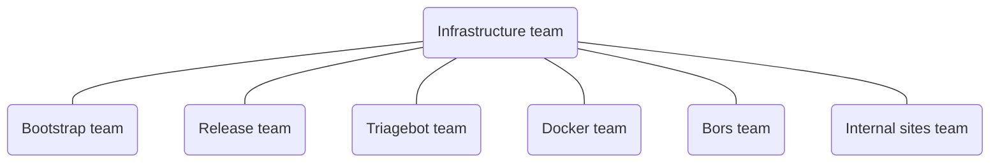

# Rust Infrastructure Team

_Managing the infrastructure supporting the Rust project itself, including CI,
releases, bots, and metrics_

The [Infrastructure Team] is one of the teams of the [Rust Project], tasked with
managing the project's infrastructure. This repository contains internal
documentation about the team's processes and services.

## Structure

The [Infrastructure Team] has several sub-teams:

## Functions

<!-- markdownlint-disable MD013 -->

| Role                   | Team member                                  |
| ---------------------- | -------------------------------------------- |
| Co-lead                | [@jdno](https://github.com/jdno)             |
| Co-lead                | [@shepmaster](https://github.com/shepmaster) |
| Council Representative | [@Kobzol](https://github.com/Kobzol)         |

<!-- markdownlint-enable MD013 -->

## Roadmap

You can see what we are working on and our backlog in our
[planning](https://github.com/orgs/rust-lang/projects/24/views/1).

Interested in contributing? Check out our
[good first issues](https://github.com/orgs/rust-lang/projects/24/views/3)

## Zulip

We have two Zulip channels:

- [t-infra](https://rust-lang.zulipchat.com/#narrow/channel/242791-t-infra) for general discussions
- [t-infra/announcements](https://forge.rust-lang.org/infra/docs/internal-announcements.html) for important announcements

## Repositories

Some of the repositories we work on:

- [simpleinfra](https://github.com/rust-lang/simpleinfra)
- [bors](https://github.com/rust-lang/bors)
- [crater](https://github.com/rust-lang/crater)

Check out the full service catalog
[here](./service-catalog/README.md).

## Meetings

- [Weekly Team Meeting](./meetings/README.md)

## Talks

Talks given by team members about the team's work:

- [RustConf 2023 - Infrastructure for Rust](https://www.youtube.com/watch?v=luBJvcGg9HQ)
- [RustNation 2024 - Rust Infrastructure: What it takes to keep Rust running](https://www.youtube.com/watch?v=GnLZMJ2r7sk)
- [RustConf 2025 - How We Made the Rust CI 75% Cheaper](https://www.youtube.com/watch?v=Gzk4uG-YzJI)

## Interviews

- [Jan David Nose @ RustConf 2025](https://www.youtube.com/watch?v=r7i-2wHtNjw)

## License

The contents of this repository are dual-licensed under the terms of the
[MIT](./LICENSE-MIT) and the [Apache 2.0](./LICENSE-APACHE) licenses.

[infrastructure team]: https://www.rust-lang.org/governance/teams/infra
[rust project]: https://www.rust-lang.org/
