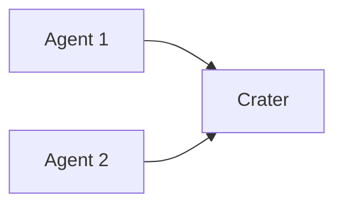

# Crater

`Crater` is a tool to run experiments across parts of the Rust ecosystem.

The `crater` service is managed in the [terraform/crater] module, while the app is in the [rust-lang/crater] repository.

You can find the detailed `crater` docs
[here](https://github.com/rust-lang/crater/tree/master/docs).

[crater.rust-lang.org] shows the status of the running experiments and the agents.

## Architecture

The crater project contains the following components:

- `crater`: server that assigns experiments (tasks) to agents
- `agent`: worker that runs experiments and reports back to the server



The agents and crater communicate over HTTP.

The agents communicate to crater their capabilities
(e.g. "windows" or "hard-drive-bigger-than-1TB") and crater assigns experiments
based on these capabilities.

## Bot

Crater can be controlled in the `rust-lang/rust` repo thanks to the GitHub bot
[@craterbot](https://github.com/craterbot). The bot replies to every command in
the comments of issues and pull requests, if the command is in its own line and
is prefixed with the bot's username.

For example, to check if the bot is alive you can write this comment:

```
@craterbot ping
```

And the bot will reply to you.

## How-to Guides

[How to update Crater](./how-to-update-crater.md)
[How to test Crater](./how-to-test-crater.md)

[crater.rust-lang.org]: https://crater.rust-lang.org
[rust-lang/crater]: https://github.com/rust-lang/crater
[terraform/crater]: https://github.com/rust-lang/simpleinfra/tree/master/terraform/crater
