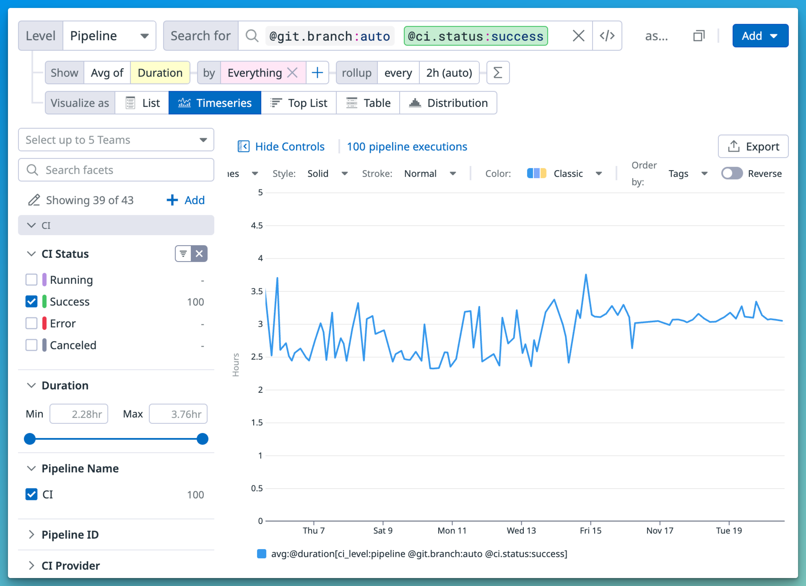
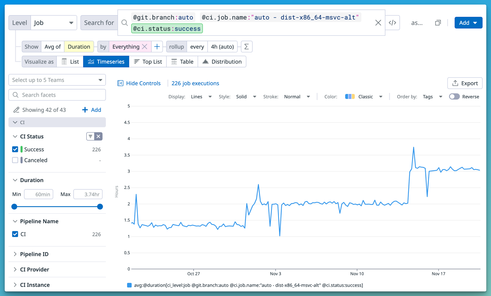

# How to monitor CI time

This guide explains how to monitor the time taken by the Rust CI.
You can monitor how long the Rust CI takes to run and other useful insights
by looking at the
[Datadog CI visibility](https://app.datadoghq.com/dash/integration/ci_app_pipelines?fromUser=false&refresh_mode=sliding&tpl_var_branch_name%5B0%5D=auto&from_ts=1731505840947&to_ts=1732110640947&live=true)
dashboard.

## Useful queries

- [Average CI time](https://app.datadoghq.com/ci/pipeline-executions?query=ci_level%3Apipeline%20%40git.branch%3Aauto%20%40ci.status%3Asuccess&agg_m=%40duration&agg_m_source=base&agg_t=avg&cipipeline_explorer_sort=time%2Cdesc&fromUser=false&index=cipipeline&mode=sliding&saved-view-id=2722979&viz=timeseries&start=1730814194903&end=1732110194903&paused=false)

  

- [CI time of a single job](https://app.datadoghq.com/ci/pipeline-executions?query=ci_level%3Ajob%20%40git.branch%3Aauto%20%40ci.job.name%3A%22auto%20-%20dist-x86_64-msvc-alt%22%20%40ci.status%3Asuccess&agg_m=%40duration&agg_m_source=base&agg_t=avg&colorBy=meta%5B%27ci.job.name%27%5D&colorByAttr=meta%5B%27ci.job.name%27%5D&currentTab=trace&fromUser=false&graphType=flamegraph&index=cipipeline&spanID=16171819458268483629&spanViewType=logs&viz=timeseries&start=1729506323634&end=1732098323634&paused=false)

  
