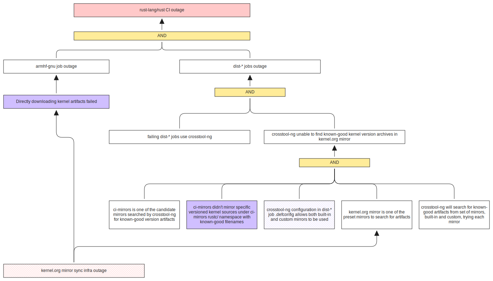
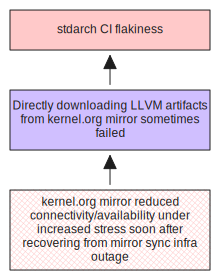
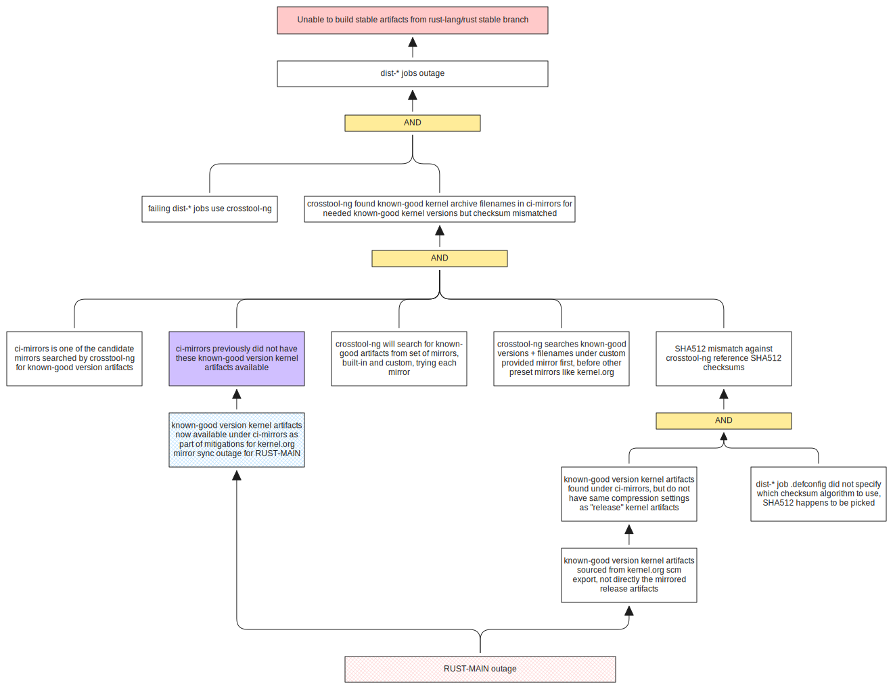
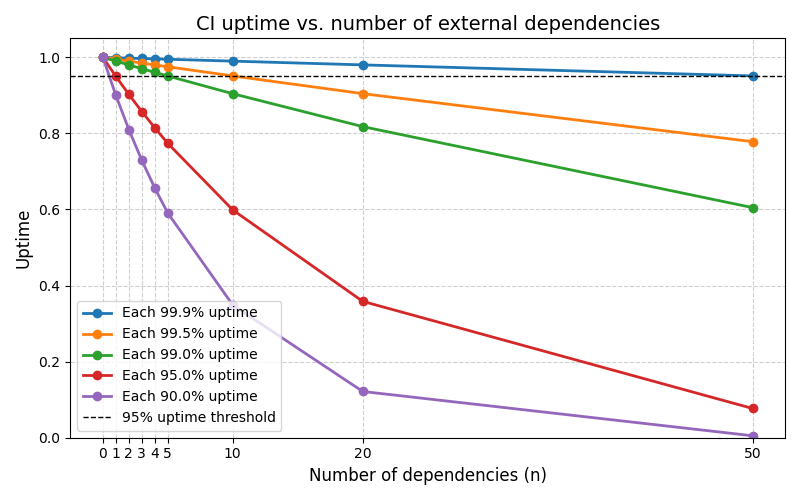

# 2026-07-02 rust-lang/rust CI outage postmortem

## Incident Summary

1. On **2026-07-02** (Thursday), `rust-lang/rust` CI jobs (including Merge and
   Try CI jobs) that directly or transitively tried to fetch kernel source
   artifacts from kernel.org mirror started to fail and the tree had to be
   closed, after the kernel.org mirror sync infrastructure had an
   [outage][linuxfoundation] where some artifacts were not available for some
   time.
2. There were secondary related outages for e.g. `rust-lang/stdarch` whose
   subset of CI jobs also tried to fetch kernel.org artifacts.
3. There was also an unintended fallout from the mitigation applied to try to
   unblock `rust-lang/rust` tree that affected the stable artifacts PR.

## Impact

This was a complex incident with 3 distinct events:

| Event       | Duration                 | Description                                                                                                                                                                                                                                                                                                                                                                                                                                                   |
| ----------- | ------------------------ | ------------------------------------------------------------------------------------------------------------------------------------------------------------------------------------------------------------------------------------------------------------------------------------------------------------------------------------------------------------------------------------------------------------------------------------------------------------- |
| RUST-MAIN   | 2026-07-02 to 2026-07-05 | Extended CI outage of `rust-lang/rust` between **2026-07-02** to **2026-07-05**, where jobs trying to fetch kernel source artifacts from kernel.org mirror was not able to find the expected artifacts. During this time, no PRs could successfully merge (including try jobs of CI jobs that depended on kernel.org mirror artifacts), including any beta backports or stable point release PRs. The 1.96.1 release notes PR was also blocked on the outage. |
| STDARCH     | 2026-07-02 to 2026-07-08 | CI flakiness experienced by `rust-lang/stdarch` starting around the same time, but instead of kernel source artifacts, `stdarch` CI was trying to fetch LLVM source artifacts from kernel.org mirrors.                                                                                                                                                                                                                                                        |
| RUST-STABLE | 2026-07-07               | The mitigation applied for RUST-MAIN to the `main` branch of `rust-lang/rust` caused an unintended fallout for the [stable artifact PR](https://github.com/rust-lang/rust/pull/158832#issuecomment-4898826163) which is against the `stable` branch.                                                                                                                                                                                                          |

### Failing `rust-lang/rust` jobs for RUST-MAIN

| Job name                       | Dependency kind on kernel.org mirror |
| ------------------------------ | ------------------------------------ |
| `armhf-gnu`                    | Direct (`wget`)                      |
| `dist-armhf-linux`             | Transitive (by `crosstool-ng`)       |
| `dist-arm-linux-gnueabi`       | Transitive (by `crosstool-ng`)       |
| `dist-powerpc64le-linux-musl`  | Transitive (by `crosstool-ng`)       |
| `dist-loongarch64-musl`        | Transitive (by `crosstool-ng`)       |
| `dist-riscv64-linux`           | Transitive (by `crosstool-ng`)       |
| `dist-powerpc64le-linux-gnu`   | Transitive (by `crosstool-ng`)       |
| `dist-mips64-linux`            | Transitive (by `crosstool-ng`)       |
| `dist-powerpc64-linux-musl`    | Transitive (by `crosstool-ng`)       |
| `dist-armv7-linux`             | Transitive (by `crosstool-ng`)       |
| `dist-powerpc-linux`           | Transitive (by `crosstool-ng`)       |
| `dist-loongarch64-linux`       | Transitive (by `crosstool-ng`)       |
| `dist-s390x-linux`             | Transitive (by `crosstool-ng`)       |
| `dist-i586-gnu-i586-i686-musl` | Transitive (by `crosstool-ng`)       |
| `dist-powerpc64-linux-gnu`     | Transitive (by `crosstool-ng`)       |
| `dist-mips-linux`              | Transitive (by `crosstool-ng`)       |
| `dist-mipsel-linux`            | Transitive (by `crosstool-ng`)       |
| `dist-mips64el-linux`          | Transitive (by `crosstool-ng`)       |

Ref: <https://github.com/rust-lang/rust/pull/158774>

### Flaky `rust-lang/stdarch` jobs for STDARCH

| Docker target name              | Dependency kind on kernel.org mirror |
| ------------------------------- | ------------------------------------ |
| `aarch64-unknown-linux-gnu`     | Direct (`wget`)                      |
| `aarch64_be-unknown-linux-gnu`  | Direct (`wget`)                      |
| `armv7-unknown-linux-gnueabihf` | Direct (`wget`)                      |
| `x86_64-unknown-linux-gnu`      | Direct (`wget`)                      |

Ref: <https://github.com/rust-lang/stdarch/pull/2186>

## Timeline

> [!NOTE]
>
> The kernel.org outage datetime uses the datetime of the first message posted
> on <https://status.linuxfoundation.org/incidents/3y1k8b4ky71t>, though I
> believe the outage occurred earlier (when folks doing rollups noticed
> rust-lang/rust CI being impacted). This is why this event seems out of
> chronological order with other events.

| Datetime (UTC)   | Description                                                                                                                                                                                                                                                                                                                                                                                                                                                                                                                                                                                                                                                                                                                                                                                                                                                                                                                                                                                                                                                                                                                                                                                                                                                                                                                                                                                                                                                                                                                                                                                                                                                                                                                                                                                                                                                               |
| ---------------- | ------------------------------------------------------------------------------------------------------------------------------------------------------------------------------------------------------------------------------------------------------------------------------------------------------------------------------------------------------------------------------------------------------------------------------------------------------------------------------------------------------------------------------------------------------------------------------------------------------------------------------------------------------------------------------------------------------------------------------------------------------------------------------------------------------------------------------------------------------------------------------------------------------------------------------------------------------------------------------------------------------------------------------------------------------------------------------------------------------------------------------------------------------------------------------------------------------------------------------------------------------------------------------------------------------------------------------------------------------------------------------------------------------------------------------------------------------------------------------------------------------------------------------------------------------------------------------------------------------------------------------------------------------------------------------------------------------------------------------------------------------------------------------------------------------------------------------------------------------------------------- |
| 2026-07-02 14:21 | kernel.org maintainers identified a misconfiguration which temporarily limited availability of source artifacts hosted on kernel.org mirrors. While a fix was available and implemented, the artifact availability recovery requires time. Artifacts started to be gradually restored. Incident: <https://status.linuxfoundation.org/incidents/3y1k8b4ky71t>                                                                                                                                                                                                                                                                                                                                                                                                                                                                                                                                                                                                                                                                                                                                                                                                                                                                                                                                                                                                                                                                                                                                                                                                                                                                                                                                                                                                                                                                                                           |
| 2026-07-02 07:48 | RUST-MAIN `rust-lang/rust` CI outage **reported**. Thread: <https://rust-lang.zulipchat.com/#narrow/channel/242791-t-infra/topic/.E2.9C.94.20kernel.2Eorg.20is.20borked/near/607776529>                                                                                                                                                                                                                                                                                                                                                                                                                                                                                                                                                                                                                                                                                                                                                                                                                                                                                                                                                                                                                                                                                                                                                                                                                                                                                                                                                                                                                                                                                                                                                                                                                                                                             |
| 2026-07-02 08:53 | RUST-MAIN **Mitigation attempt 1**: mirroring kernel.org artifacts to our own `ci-mirrors`. Mitigation attempt was **unsuccessful**, since the required artifacts were still not yet restored on the kernel.org mirror.                                                                                                                                                                                                                                                                                                                                                                                                                                                                                                                                                                                                                                                                                                                                                                                                                                                                                                                                                                                                                                                                                                                                                                                                                                                                                                                                                                                                                                                                                                                                                                                                                                                |
| 2026-07-03 05:13 | RUST-MAIN Some artifacts have recovered on kernel.org, so a merge attempt started for a single PR. This was **unsuccessful** because jobs were depending still on not-yet-recovered kernel.org artifacts.  More in-depth investigations into the outage began. `armhf-gnu` directly trying to download kernel.org artifacts was observed. Message: <https://rust-lang.zulipchat.com/#narrow/channel/242791-t-infra/topic/.E2.9C.94.20kernel.2Eorg.20is.20borked/near/607988180>                                                                                                                                                                                                                                                                                                                                                                                                                                                                                                                                                                                                                                                                                                                                                                                                                                                                                                                                                                                                                                                                                                                                                                                                                                                                                                                                                                               |
| 2026-07-03 05:46 | RUST-MAIN **Mitigation attempt 2**: temporarily disabling `armhf-gnu` (since the target being tested was for Tier 2 at most, where we do not guarantee tests are run). Mitigation attempt was **unsuccessful**, since there are `dist-*` jobs that transitively depended on kernel.org artifacts through `crosstool-ng`. At this point, we would wait a day since it's a legal holiday in the US so we anticipated slower recovery on the kernel.org side, and did not anticipate kernel.org mirror artifact recovery to take so long. Message: <https://rust-lang.zulipchat.com/#narrow/channel/242791-t-infra/topic/.E2.9C.94.20kernel.2Eorg.20is.20borked/near/607991609>                                                                                                                                                                                                                                                                                                                                                                                                                                                                                                                                                                                                                                                                                                                                                                                                                                                                                                                                                                                                                                                                                                                                                                                        |
| 2026-07-04 08:17 | RUST-MAIN **Mitigation attempt 3**: source kernel artifacts from alternative sources, and mirror them in `ci-mirrors`. During the mitigation attempt, it was realized the `dist-*` jobs depended on multiple kernel series through different `crosstool-ng` configurations, namely {3.2.x, 3.10.x, 4.4.x, 4.19.x, 4.20.x, 5.19.x}. We tried to source kernel artifacts for each of such release series from alternative sources (Wayback Machine, out-of-sync kernel mirrors). Newest versions in each release artifacts were usually not available (in terms of both {archive, signature} pair). This avenue of approach was abandoned, since it felt a bit questionable trying to seed our `ci-mirrors` artifacts from non-official sources (questionable attestation).                                                                                                                                                                                                                                                                                                                                                                                                                                                                                                                                                                                                                                                                                                                                                                                                                                                                                                                                                                                                                                                                                              |
| 2026-07-04 11:41 | RUST-MAIN **Mitigation attempt 4**: directly export from kernel.org git archive exports, and use those archives to source `ci-mirrors`. First `ci-mirrors` PR: <https://github.com/rust-lang/ci-mirrors/pull/42> It turns out this was not sufficient; this PR uses latest release versions for each kernel release series, but `crosstool-ng` for its mirrors, actually tries to discover kernel artifacts for (1) known good kernel versions in each release series by artifact filename, not necessary latest, and (2) for each known good version, `crosstool-ng` also compares known good checksums. A follow-up `ci-mirrors` PR is opened to mirror the older known good versions that `crosstool-ng` 1.28.0 expected. Attempts were made to adjust the `crosstool-ng` version to look for specific kernel versions we already mirrored to no avail. Second `ci-mirrors` PR: https://github.com/rust-lang/ci-mirrors/pull/46 It was then noticed that `crosstools-ng` expects a very specific flat namespace structure for artifact mirrors, so a third `ci-mirrors` PR was needed to re-mirror kernel artifacts under a flatter namespace. Third `ci-mirrors` PR: <https://github.com/rust-lang/ci-mirrors/pull/43> Then it was noticed that even with flat namespace, `crosstool-ng` known versions, that `crosstool-ng` rejected the archives we mirrored in `ci-mirrors`, presumably the git archive exports had different compression settings versus the kernel.org archives. To address this, a patch to override the known-good version's SHA256 checksum (since that's what `ci-mirrors` use) in `crosstool-ng` was used, and also a patch to explicitly pick SHA256 as the checksum algorithm for `crosstool-ng` was applied to `dist-*` `.defconfig`s. `rust-lang/rust`-side PR: <https://github.com/rust-lang/rust/pull/158774> |
| 2026-07-05 00:22 | RUST-MAIN **Mitigation**: `rust-lang/rust`-side **mitigation** PR <https://github.com/rust-lang/rust/pull/158774> merged, following jobs started to **recover**.                                                                                                                                                                                                                                                                                                                                                                                                                                                                                                                                                                                                                                                                                                                                                                                                                                                                                                                                                                                                                                                                                                                                                                                                                                                                                                                                                                                                                                                                                                                                                                                                                                                                                                       |
| 2026-07-06 04:26 | RUST-MAIN **Recovery**: tree was **re-opened**.                                                                                                                                                                                                                                                                                                                                                                                                                                                                                                                                                                                                                                                                                                                                                                                                                                                                                                                                                                                                                                                                                                                                                                                                                                                                                                                                                                                                                                                                                                                                                                                                                                                                                                                                                                                                                        |
| 2026-07-06 17:13 | kernel.org mirrors fully **recovered**.                                                                                                                                                                                                                                                                                                                                                                                                                                                                                                                                                                                                                                                                                                                                                                                                                                                                                                                                                                                                                                                                                                                                                                                                                                                                                                                                                                                                                                                                                                                                                                                                                                                                                                                                                                                                                                   |
| 2026-07-07 00:26 | RUST-STABLE Stable artifacts PR <https://github.com/rust-lang/rust/pull/158832> was failing due to **unanticipated fallout** from the mitigation applied to `main`: since we now mirror known-good artifacts in `ci-mirrors` but with different checksums, the `stable`-targeting PR was failing as the `stable` branch did not have the SHA256 patches for `crosstool-ng`, but `crosstool-ng` was searching for the now-existing known-good kernel artifacts in `ci-mirrors`. The filenames were matching but the checksums did not. This is because previously _some_ other artifacts were previously already provided under `ci-mirrors` to `crosstool-ng` (so already a known mirror). The mitigation PR was cherry-picked into the stable artifacts PR which **resolved** the issue.                                                                                                                                                                                                                                                                                                                                                                                                                                                                                                                                                                                                                                                                                                                                                                                                                                                                                                                                                                                                                                                                              |
| 2026-07-07 13:03 | STDARCH Residual **flakiness** in `stdarch` CI was reported, due to depending on LLVM source artifacts from kernel.org mirror. By this time the mirror artifacts were recovered, but the kernel.org availability/connectivity was sometimes unstable. A **mitigation** was applied to mirror used LLVM source artifacts in `ci-mirrors`, this time from kernel.org mirrors as the sources have recovered there. `ci-mirrors` PR: <https://github.com/rust-lang/ci-mirrors/pull/49> `stdarch` PR: <https://github.com/rust-lang/stdarch/pull/2186>                                                                                                                                                                                                                                                                                                                                                                                                                                                                                                                                                                                                                                                                                                                                                                                                                                                                                                                                                                                                                                                                                                                                                                                                                                                                                                                |
| 2026-07-08 03:28 | STDARCH Mitigation PR merged and flakiness from kernel.org LLVM artifact dependence was **resolved**.                                                                                                                                                                                                                                                                                                                                                                                                                                                                                                                                                                                                                                                                                                                                                                                                                                                                                                                                                                                                                                                                                                                                                                                                                                                                                                                                                                                                                                                                                                                                                                                                                                                                                                                                                                  |

## Root Cause Analysis

### RUST-MAIN

- Direct and indirect dependence on external resource (kernel.org mirror) and
  not mirroring kernel archives in our own mirrors.
- Relying on implicit cascading fallback search logic for known-good artifacts
  in {built-in, custom} mirror of `crosstool-ng`, where we do not mirror all
  known-good artifacts that `crosstool-ng` is searching for.

### STDARCH

- Direct dependence on external resource (kernel.org mirror) and not mirroring
  LLVM archives in our own mirrors.

### RUST-STABLE

For RUST-STABLE, the mitigation to address RUST-MAIN actually itself caused
unintended fallout:

- Relying on implicit cascading fallback search logic for known-good artifacts
  in {built-in, custom} mirror of `crosstool-ng`, where we do not mirror all
  known-good artifacts that `crosstool-ng` is searching for.

## Corrective and Preventative Measures

| Kind         | Description                                                                                                                                                                                                                                                                        |
| ------------ | ---------------------------------------------------------------------------------------------------------------------------------------------------------------------------------------------------------------------------------------------------------------------------------- |
| Corrective   | Switch `armhf-gnu` to download kernel archive from our own mirror                                                                                                                                                                                                                  |
| Corrective   | Switch `armhf-gnu` to download busybox/ubuntu rootfs from our own mirror                                                                                                                                                                                                           |
| Corrective   | Switch `dist-*` `crosstool-ng` configuration to use kernel archives from our own mirror                                                                                                                                                                                            |
| Corrective   | Adjust `dist-*` `crosstool-ng` `.defconfig` configurations to look for specific kernel versions.                                                                                                                                                                                   |
| Preventative | (Longer-term) Gradually mirror other artifacts used by `crosstool-ng` in the `dist-*` jobs (including gcc artifacts and more), then force `crosstool-ng` to use _only_ our custom mirror and not also the built-in external mirrors.                                               |
| Preventative | Establish infra team policy for rust-lang/rust job additions and job changes to avoid introducing dependence on external sources unless (1) the external source is already allow-listed, (2) the external source cannot be mirrored or should not be mirrored for a strong reason. |
| Preventative | (Longer-term) Switch rust-lang/rust images to allow-list selected external sources (from the POV of the images), e.g. try to allow-list our own mirror, crates.io, GitHub container registry and docker registry. (Automated enforcement of the above policy.)                     |

## Lessons Learned

### Summary

- Reduce external dependency to a bare minimum, where feasible and where it
  makes sense.
  - Not all external dependency are of the same nature, some probably _should
    not_ be naively mirrored.
  - This depends on the needs for each of such external dependency.
  - Be deliberate about what external dependency you introduce, and they should
    generally have strong justification, or else they should probably be avoided
    by e.g. vendoring or mirroring. Know what external dependency you actually
    have.
  - Be aware of not just direct dependencies on external sources, but also
    indirect/transitive dependencies.
- For tools like `crosstool-ng`, know what transitive external dependencies they
  might be automatically searching for, and where possible, configure such build
  tools to only look for artifacts in our own mirror.
- Ideally we'd like more observability into when rust-lang/rust CI goes down,
  becomes entirely unavailable, or has elevated failure rates. But we don't
  really have on-call rotations for rust-lang/rust CI (and IMO that's not
  necessary) so having contributors (especially folks handling rollups)
  collaborate on reporting rust-lang/rust CI issues isn't a big deal.
  - It's possible to use Datadog and setup dedicated notification stream on Zulip
    with updates backlinking to Datadog that would allow noticing the elevated
    error rates more proactively instead of just relying on passive reporting.

#### Example: modelling impact of dependence on external networked resources

It's not always straightforward to have a feel for the impact of availability of
external dependence to our CI's availability, so let's do some very naive
modelling.

Consider a hypothetical rust-lang/rust CI $R$ that hard-depends on $n$ external
resources, each denoted $E_{i}$, where if any of the external resources becomes
unavailable, then so does rust-lang/rust CI. Let us denote $\mathrm{P}(E_{i}) :=
p$ as the _uptime_ likelihood of each external resource at any given moment of
time. Then the _uptime_ likelihood of rust-lang/rust CI is given by
$\mathrm{P}(R) := \prod_{i \in [0, n]} \mathrm{P}(E_{i})$, assuming the uptime
of external resources are independent[^indep].

[^indep]:
    In practice this is not necessarily true and often not true, but for
    our modelling purposes let's just pretend it is.

- Recall that:
  - 99.9% annual uptime corresponds to approx. 8 hours of downtime
  - 99% annual uptime corresponds to approx. 4 days of downtime
  - 95% annual uptime corresponds to approx. 18 days of downtime
- For rust-lang/rust CI, generally 95% uptime and above is where we want to be
  before it makes getting things done _very_ annoying.
- If each external dependency has 99.9% uptime, then rust-lang/rust CI would
  only be expected to drop below the 95% threshold at approx. more than 50
  external dependencies.
- If each external dependency has 99.5% uptime, that drops to about 10.
- If each external dependency has 99% uptime, that drops to merely about 5.

In practice, different external dependencies will of course have varying degree
of uptime. The takeaway here is that if there are several external dependencies
with relatively low uptime, that can substantially impact the overall uptime.

### What went well

- We were able to directly source archives from kernel.org scm.
- kernel.org did gradually recover all artifacts towards the end of this
  incident.
- The mitigation was not super involved, i.e. we only had to patch SHA256
  checksums of known-good versions in `crosstool-ng` and didn't have to change
  `crosstool-ng` otherwise in more involved ways.

### What didn't go well

- `dist-*` jobs were relying on certain implicit default behaviors of
  `crosstool-ng` (cascading mirror searches, known-good kernel versions).
- `crosstool-ng` 1.28 didn't use the latest kernel version in each `X.Y.*`
  release series, which made it slightly more complicated.
- There were multiple kernel release series being used.

### Where we got lucky

- Only kernel source archives were needed.
- The complexity to mitigate incident was not super high.
- It occurred earlier than release week (incident occurred during the week
  before and the weekend before release week), and didn't directly block stable
  release (the mitigation itself could be stable-backported).

[main-infra-thread]: https://rust-lang.zulipchat.com/#narrow/channel/242791-t-infra/topic/.E2.9C.94.20kernel.2Eorg.20is.20borked/near/607776529
[stdarch-infra-thread]: https://rust-lang.zulipchat.com/#narrow/channel/242791-t-infra/topic/.E2.9C.94.20kernel.2Eorg.20is.20borked.20.28stdarch.20variant.29/with/609020474
[stable-artifact-backport-infra-thread]: https://rust-lang.zulipchat.com/#narrow/channel/242791-t-infra/topic/.E2.9C.94.20kernel.2Eorg.20backport.3F/with/608703064
[linuxfoundation]: https://status.linuxfoundation.org/incidents/3y1k8b4ky71t
